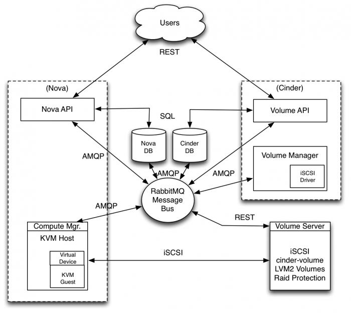

# Cinder 區塊儲存套件
Cinder提供了```Block Storage Service```，替虛擬機增加了永久性儲存空間，區塊儲存服務提供了基礎設施作為Volume的管理，以及與```Compute Service```互動，提供給Instance Volume使用。此服務工作亦包含volume 快照、volume 類型的管理等，除了用來給Instance提供區塊等級(Block Level)儲存空間外，也提供快照、資料復原等功能，並可以整合其他商業化儲存平台，如NetApp、Nexenta、SolidFire等。



區塊儲存服務包含了以下元件：
* **cinder-api**：用來接受來自外部對於 volume 空間的請求後，透過 message queue 將請求轉給 cinder-scheduler 後再轉給 cinder-volume 進行後續處理。
* **cinder-volume**：直接與區塊儲存服務互動，以及諸如cinder-scheduler的流程互動，他與這些流程互動是透過Message Queue來達到。cinder-vloume服務會回應那些發送到區塊儲存服務的讀取請求，以維護目前狀態，可以與多個儲存供應商透過驅動架構做互動。

 流程大致以下三點：
    1. 接收來自 cinder-scheduler 的命令，建立新的 volume。
    2. 接收來自 message queue 的訊息，進行 volume 空間的讀寫。
    3. 透過不同的 driver，還可以使用多種不同的 storage provider 所提供的設備。

* **cinder-scheduler daemon**：類似 nova-schedular 的角色，接收到來自 Message Queue 的命令後，會從多個(如果有)提供 block storage 服務的 node 挑選出一個最合適來建立 volume。
* **cinder-backup daemon**：cinder-backup 服務提供了備份任何類型的volume到備份儲存供應商。類似cinder-volume服務，他透過一個驅動架構與各種儲存供應商相互作用。
* **Message Queue**：負責將訊息派送給各個 Block Storage service。
*
