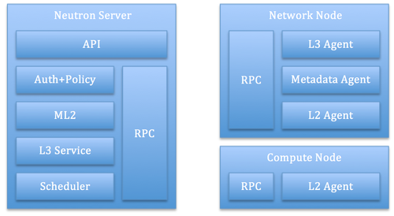
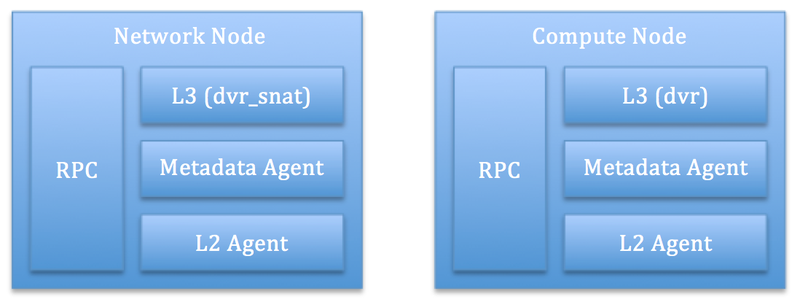

# Distributed Virtual Router 分散式路由
OpenStack 管理員在部署與建置 OpenStack 時，會發現採用 Neutron 原始的設計，所有網路都須通過 ```Network 節點```上的Public Ethernet，這樣的架構會讓 Network 節點帶來很大的流量與處理壓力。

在一個 Neutron 部署中，跨越虛擬網路的 VM 之間的封包流量，我們稱為```東西向流量```; 然而在虛擬網路的 VM 與經由 DNAT （Destination NAT）與外部網路的資料交換，我們稱為```南北向流量```（有  floating IP 的 VM 與對外溝通）。上述提到在比較大的流量壓力下，集中式的虛擬路由（Virtual Route）是一個難題與可能發生 ```SPOS（Single Point Of Failure）```，因為不管哪個流向流量都是經過 Network 節點，因此造成了互相影響。

DVR（Distributed Virtual Router）將增強的 L3 Agent 也可以部署到每個 Compute 節點上，然後 SNAT（Source NAT）則一樣部署在 Network 節點，這樣方式使東西向流量不需經過 Network 節點，可以從一個 Hypervisor 直接連接到另一個 Hypervisor。這樣架構為我們帶來以下好處：

* 東西向流量的 Throughput 的增加。
* 東西向流量的 Average Bandwidth 的增加。
* 南北向與東西向流量不再互相後干擾。
* 當東西向流量在同一個 Hypervisor上，就不會走過不必要的路徑。


預設下， L3 Agent與 DHCP Agent 都部署在 Network 節點上，這樣大規模的雲端環境會存在著效能的問題。我們可以看到未使用 DVR 的架構圖如下：


然後由於以上問題，透過使用 DVR 使 L3 的轉發與 NAT 會被分散在 Compute 節點上，這使得 Compute 節點也成為了一部分的 Network 節點，這樣原有集中式的 Network 節點乘載的負擔被減輕了。


然而也可以實現[分散式的 DHCP Agent](https://blueprints.launchpad.net/neutron/+spec/distributed-dhcp)，這樣可以進一步分擔集中式 Network 節點的負載壓力。
