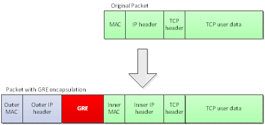

# GRE

GRE（Generic Routing Encapsulation，通用路由封裝）是一種 IP-over-IP 的隧道協定（Tunneling Protocol），可以在虛擬對等鏈路中封裝多種網路層協定，是現今主要使用的 Overlay 網路技術之一。GRE 是 Cisco 等公司提出的技術，對部分網路層協定進行封裝並在 IPv4\/IPv6 網路中傳輸，簡單說就是一種協定封裝格式，定義了如何用一種網路協定去封裝另一種網路協定。

如下圖所示，GRE 將原本一個普通的 IP 網路協定封裝，又依照 IP 網路協定的路由方式進行路由。可以看出 GRE 運作於 IP 層之上，且對真正的 IP （Inner IP）做處理，最後封裝後成為 Outer IP，這樣就可以依照路由表來運作，然而當封包傳達目的地時會在還原為真正的 IP。

下圖為 GRE Header：

簡單說 GRE Tunnel 原理，當我們讓兩台網路介面建立了私有通道時。當封包傳送給對方時，會將封包丟到建立 GRE Tunnel的邏輯介面進行轉送，當資料抵達另一方的邏輯介面時，在將被封裝成 GRE 的封包恢復成原始狀態傳送給目的地，因此取得的封包是乾淨的。

OpenStack Neutron 透過 GRE 來建立 Instance 對外的網路流向，如以下架構圖：

GRE 有以下優缺點：

* 可跨區域部署的 L3 通道技術。
* 使用 4 bytes 的 Segment ID 來通當 VLAN ID 的租戶隔離。
* 基於點對點通道協定（Point to Point Tunneling Protocol），每兩個點需要有一個通道，對於第四層網路埠口（Port）資源是一種浪費。
* 增加 IP Header，因此會減少 Instance 的 MTU 值，因此會影響傳輸效率。
* 不支援群組廣播，同網路中的一個虛擬機發送廣播 Frame 後，GRE 會將其廣播到所有與該節點有通道連接的節點。
* GRE 封裝的 IP 封包過濾與負載平衡問題，有許多第三層網路與防火牆裝置無法解析。

