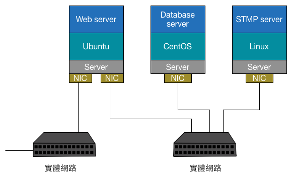
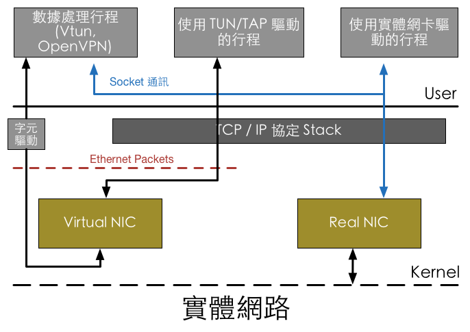
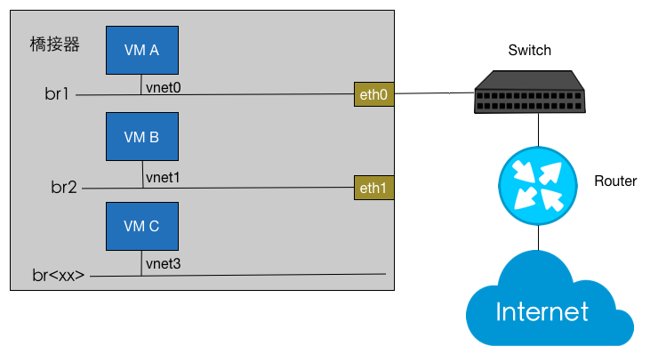
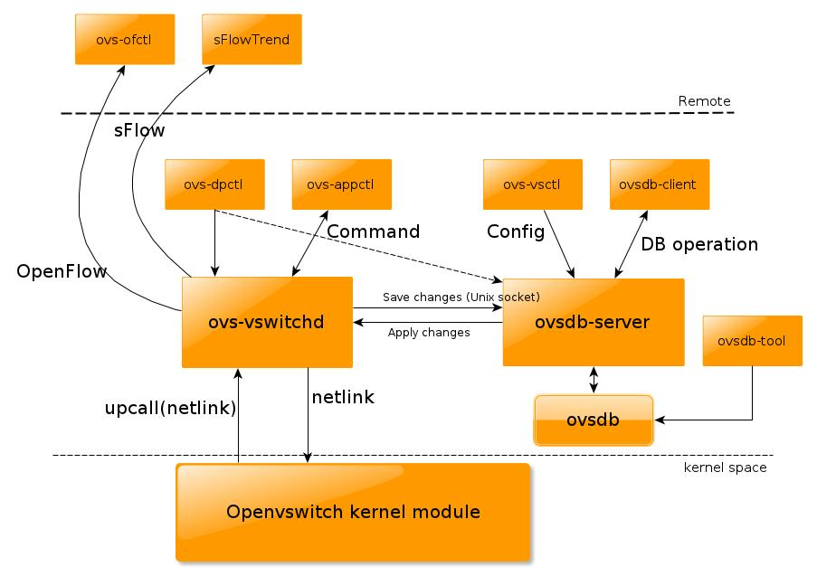

# Linux 中的虛擬化網路

在討論 Neutron 細節的虛擬化功能前，我們需要先了解 Neutron 應用到的 Linux 上的網路虛擬化技術。Neutron 最核心的工作是對第二層實體網路 Network 的抽象與管理。在一個傳統的實體網路下，可能有多組實體 Server，上面分別執行各種應用，諸如：Web、Database等服務，為了能夠彼此溝通，每台主機都會擁有一張實體網卡（NIC），每張網卡會連接到一台實體交換器（Switch）上，如下圖所示：

然而虛擬化技術被導入後，傳統的多作業系統與應用可以透過虛擬機方式分享同一實體 Server，虛擬機的管理、啟動、建立等操作 Hypervisor（或者 VMM，Virtual Machine Manager）來完成，然而形成了以下的網路結構：

虛擬機的網路功能是利用虛擬網卡（vNIC）提供，Hypervisor 可以為每個虛擬機建立一張或多張虛擬網卡。為了實現與傳統實體網路相等的網路結構，Switch 也被虛擬化為 虛擬交換器（vSwitch），這樣 vNIC 會連接於 vSwitch 上，最後 vSwitch 會透過實體主機 NIC 存取外部的實體網路。

由上述可見，對一個虛擬的第二層網路結構來說，主要完成兩種網路設備的虛擬化`Network interface controller（vNIC）`、`Switch（vSwitch）`，在 Linux 等下網路裝置的虛擬化有以下幾種，然而 Neutron 也是基於這些技術來完成 Tenant 私有網路的建置。

### TAP\/TUN

TAP\/TUN 是 Linux Kernel 實現的虛擬化網路設備，TAP 運作於`第二層網路`，TUN 運作於`第三層網路`，Linux Kernel 透過 TAP\/TUN 向使用該設備的 User-space 程式發送數據，反之 User-space 程式也可以像操作硬體網路設備一樣，透過 TAP\/TUN 設備發送數據。

* **TAP（Network TAP）**：乙太網路設備虛擬化、模擬乙太網路裝置、接收Layer 2 封包（Eth frames）、可用於建立網路橋接\(Network bridge\)。
* **TUN（Network Tunnel）**：點對點設備的虛擬化、模擬 Layer 3 網路裝置、接收 Layer 3 封包（IP packet）、可用於 Router。

當一個 TAP 設備被建立時，在 Linux 設備檔案目錄下將會生成一個對應 char 設備，使用者行程可以像打開普通檔案一樣進行讀寫。當執行write\(\)時，數據會進入 TAP 設備，此時對 Linux 網路層來說，相當於 TAP 設備收到一個封包，並請求 Kernel 接收，如同普通的實體網卡從外網收到封包一樣，不同的是其實數據來自Linux的一個使用者行程。

### VETH

VETH 即虛擬 Ethernet 介面，通常以 Pair的方式出現，一端發送封包，另一端則會接收，可以形成兩個橋接之間的通道。它的作用是反轉通訊數據的方向，需要發送的數據會被轉換成需要收到的數據，並重新發送至 kernel 網路層進行處理，從而間接完成數據的注入。

### Bridge

了解 TAP 的基本運作原理與使用方式後，在架構虛擬電腦時，不全然要將虛擬電腦部署在內部網路之內，好比，如果此虛擬機要提供網路服務的話，像是Web service，就不適合將虛擬機放置在內部網路，反而是要提供一組可對外聯繫的 IP，這樣 Web service 才能對外提供存取。而除了手動指定 IP 位址外，利用 Bridge 的功能一樣可以讓虛擬機取得對外聯繫的 IP。

在 Linux 作業系統的 KVM 虛擬化環境內，為掛載虛擬機器，橋接器介面的標示通常會是 vnet0、vnet1等符號。

### Open vSwitch

隨著虛擬化技術發展，使軟體可在實體主機內建構一台與硬體交換器具備相同特性的軟體交換器，並更好地服務實體主機的虛擬機器內外通訊。

Open vSwitch 就是一個開放的軟體虛擬交換器，具備產品級品質，我們可利用該軟體部署一些正式上線的環境中使用，它出現滿足虛擬化技術的要求。因為在虛擬化環境中，主機都是建立在 OS 中，而多個主機間的連接除了可以使用 Linux 的橋接器、VLAN等傳統做法實現外，也可以透過虛擬交換器 Open vSwitch 來連接。Open vSwitch 不僅支援基本的第二層網路交換，還提供標準的管理介面與協定（如NetFlow、sFlow、SPAN、RSPAN、CLI、LACP、802.1 ag），同時支援OpenFlow來進行SDN的整合。

由於 Open vSwitch 開放且能夠滿足各種應用的需求，OpenStack 在F、G等版本中早已提供了 Open vSwitch的支援，了解 Open vSwitch是如何運作的，對於管理 OpenStack 系統是有幫助的。

