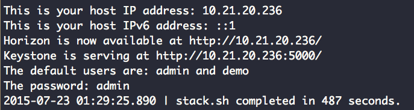

# DevStack all-in-one 安裝
以下將利用 DevStack 進行單一節點的安裝，來提供一個開發與測試用 OpenStack 環境，首先安裝 Git 套件與下載 OpenStack git 資源庫：
```sh
$ sudo apt-get install -y git
$ git clone https://git.openstack.org/openstack-dev/devstack
$ git checkout stable/mitaka
```

### 網路設定
由於會使用到 ```Neutron```，因此我們須在單一電腦安裝兩張網卡介面，分別為以下：
* **Eth0**：Internet 網路，這邊實驗網段為```10.21.20.0/24```。
* **Eth1**：與 ```eth0``` 同網段，拿來做為 Public 網路存取使用，需將網卡設定為以下：
```
auto eth1
iface eth1 inet manual
up ifconfig $IFACE 0.0.0.0 up
down ifconfig $IFACE 0.0.0.0 down
```

### DevStack localrc 設定
若想客製化 DevStack 安裝套件，需要編輯```localrc```來變更預設的安裝配置，一個簡單的範例如下：
```sh
# Misc
ADMIN_PASSWORD=sysadmin
DATABASE_PASSWORD=$ADMIN_PASSWORD
RABBIT_PASSWORD=$ADMIN_PASSWORD
SERVICE_PASSWORD=$ADMIN_PASSWORD
SERVICE_TOKEN=$ADMIN_PASSWORD

# Target Path
DEST=/opt/stack.kilo

# Enable Logging
LOGFILE=$DEST/logs/stack.sh.log
VERBOSE=True
LOG_COLOR=True
SCREEN_LOGDIR=$DEST/logs

# Nova
enable_service n-novnc n-cauth

# Neutron
disable_service n-net
ENABLED_SERVICES+=,q-svc,q-agt,q-dhcp,q-l3,q-meta,neutron
ENABLED_SERVICES+=,q-lbaas,q-vpn,q-fwaas

# Swift
enable_service s-proxy s-object s-container s-accounts
SWIFT_HASH=66a3d6b56c1f479c8b4e70ab5c2000f5

# Ceilometer
enable_service ceilometer-acompute ceilometer-acentral ceilometer-anotification ceilometer-collector ceilometer-api
enable_service ceilometer-alarm-notifier ceilometer-alarm-evaluator

# Heat
enable_service heat h-api h-api-cfn h-api-cw h-eng

# Sahara
enable_service sahara

# FIXED_RANGE=10.0.0.0/24
HOST_IP=<YOUR_HOST>
FLOATING_RANGE=10.21.20.1/24
PUBLIC_NETWORK_GATEWAY=10.21.20.254
Q_FLOATING_ALLOCATION_POOL=start=10.21.20.100,end=10.21.20.150
```

### 確認 ovs 設定
透過 ```ovs-vsctl show``` 確認是否正確建立一個名為```br-ex```虛擬 Switch ：
```sh
$ sudo ovs-vsctl show
```
> 若沒有透過 ```sudo ovs-vsctl add-br br-ex``` 新增。

將```eth1```當作```br-ex```介面：
```sh
$ sudo ovs-vsctl add-port br-ex eth1
```

### 執行與驗證
當完成以上配置後，我們在 devstack 目錄底下執行該Script：
```sh
$ ./stack.sh
```
完成後會看到以下資訊：


若都沒問題進入 [Horizon Dashborad](http:localhost/) 或者透過 CLI 進行操作。

### 停止服務與清除
若不想再使用本次安裝，可以透過以下方式做移除動作：
```sh
$ ./unstack.sh
$ ./clean.sh
```
