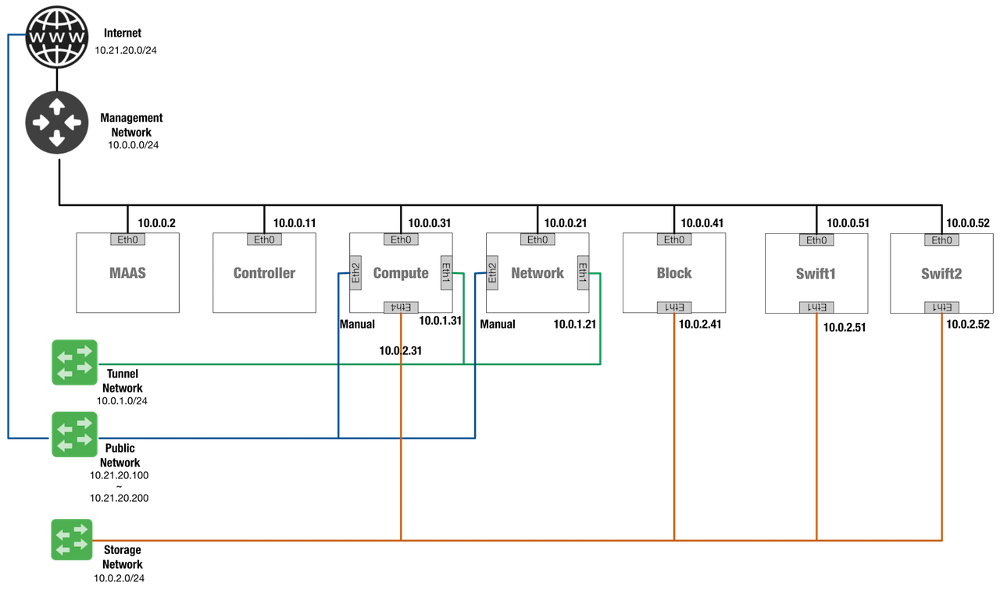

# Neutron 多節點安裝
### 硬體規格分配
* **Controller Node**: 四核處理器, 8 GB 記憶體, 20 GB 儲存空間
* **Network Node**: 雙核處理器, 4 GB 記憶體, 20 GB 儲存空間
* **Compute Node**: 四核處理器, 8 GB 記憶體, 32 GB 儲存空間

> 注意以上節點的 Linux OS 請採用```64位元```的版本，因為若是在 Compute 節點安裝```32位元```，在執行映像檔時，會出錯。

> 且每個節點儲存空間必須大於規格，若需要安裝其他服務，並分離儲存磁區時，請採用```Logical Volume Manager (LVM)```。

> 如果您選擇安裝在虛擬機上，請確認虛擬機是否允許混雜模式，並關閉MAC地址，在外部網絡上的過濾。

網路架構圖如下：


### 網路分配與說明
這次安裝會採用```Neutron```網路套件來網路的處理，本次架構需要一台Controller、Network、Compute節點(若加其他則不同)，在 Network節點上需要提供一張作為```管理網路```、一張 ```Instance溝通```、一張```外部網路```的網路介面(NIC)，詳細分配如下：

* **管理網路**：10.0.0.0/24，有Gateway 10.0.0.1。

 > 需要提供一個Gateway來為所有節點提供內部管理存取，例如套件的安裝、安全更新、DNS 以及 NTP等。

* **Instance通道網路**：10.0.1.0/24，無Gateway。

 > 不需要設定Gateway，因為這是Network節點與Compute的Instance做GRE使用。

* **外部網路**：192.168.20.0/24，有Gateway 192.168.20.1。

 > 提供一個外部網路，讓Network節點可以透過GRE使Compute節點上的Instance存取網際網路，```注意！這邊會根據環境的不同而改變```。


 以下指令可以幫助你設定```sudo```與```eth```：
```sh
# 設定不需要密碼
echo "openstack ALL = (root) NOPASSWD:ALL" | sudo tee /etc/sudoers.d/openstack && sudo chmod 440 /etc/sudoers.d/openstack

# 列出eth device
dmesg | grep -i network

# 修改/etc/network/interfaces
auto eth0
iface eth0 inet static
        address 10.0.0.11
        netmask 255.255.255.0
        gateway 10.0.0.1
        dns-nameservers 8.8.8.8
```
設定腳本：
```sh
ID=$((30+$(hostname | grep -o "[0-9]*")))
MANAGE_ETH=eth2
TUNNEL_ETH=eth0
PUBLIC_ETH=eth1
echo "auto lo" | sudo tee /etc/network/interfaces
echo "
auto ${MANAGE_ETH}
iface ${MANAGE_ETH} inet static
        address 10.0.0.${ID}
        netmask 255.255.255.0
        gateway 10.0.0.1
        dns-nameservers 8.8.8.8
" | sudo tee -a /etc/network/interfaces

echo "
auto ${TUNNEL_ETH}
iface ${TUNNEL_ETH} inet static
        address 10.0.1.${ID}
        netmask 255.255.255.0
" | sudo tee -a /etc/network/interfaces

echo "
auto ${PUBLIC_ETH}
iface ${PUBLIC_ETH} inet manual
        up ip link set dev \$IFACE up
        down ip link set dev \$IFACE down
" | sudo tee -a /etc/network/interfaces

```

### Controller node 設定
將第一張網卡介面設定為```管理網路```：
* IP address: 10.0.0.11
* Network mask: 255.255.255.0 (or /24)
* Default gateway: 10.0.0.1

完成後，重新開機來改變設定。

再來修改```/etc/hostname```來改變主機名稱為```controller```，並設定主機的```/etc/hosts```：
```sh
# controller
10.0.0.11   controller
# network
10.0.0.21   network
# compute1
10.0.0.31   compute1
```
> 注意！若有```127.0.1.1```存在的話，請將之註解掉，避免解析問題。

### Network node 設定
將第一張網卡介面設定為```管理網路```：
* IP address: 10.0.0.21
* Network mask: 255.255.255.0 (or /24)
* Default gateway: 10.0.0.1

然後將第二張設定為```Instance溝通介面```：
* IP address: 10.0.1.21
* Network mask: 255.255.255.0 (or /24)

再來設定```外部網路介面```，外部網路比較特殊，但我們可以將名稱命名為```eth2```或```ens256```等名稱，可以修改檔案```/etc/network/interfaces```：
```sh
# The external network interface
auto <INTERFACE_NAME>
iface <IINTERFACE_NAME> inet manual
        up ip link set dev $IFACE up
        down ip link set dev $IFACE down
```
完成後，重新開機來改變設定。

再來修改```/etc/hostname```來改變主機名稱為```network```，並設定主機的```/etc/hosts```：
```sh
# network
10.0.0.21       network
# controller
10.0.0.11       controller
# compute1
10.0.0.31       compute1
```
> 注意！若有```127.0.1.1```存在的話，請將之註解掉，避免解析問題。

### Compute node設定
將第一張網卡介面設定為```管理網路```：
* IP address: 10.0.0.31
* Network mask: 255.255.255.0 (or /24)
* Default gateway: 10.0.0.1

> 若有多個Compute node，則以10.0.0.32類推。

然後將第二張設定為```Instance溝通介面```：
* IP address: 10.0.1.31
* Network mask: 255.255.255.0 (or /24)

> 若有多個Compute node，則以10.0.1.32類推。

完成後，重新開機來改變設定。

再來修改```/etc/hostname```來改變主機名稱為```compute1```，並設定主機的```/etc/hosts```：
```sh
# compute1
10.0.0.31       compute1
# controller
10.0.0.11       controller
# network
10.0.0.21       network
```

> 注意！若有```127.0.1.1```存在的話，請將之註解掉，避免解析問題。

完成上述設定後，可利用```ping```指令於每個節點做網路測試。
