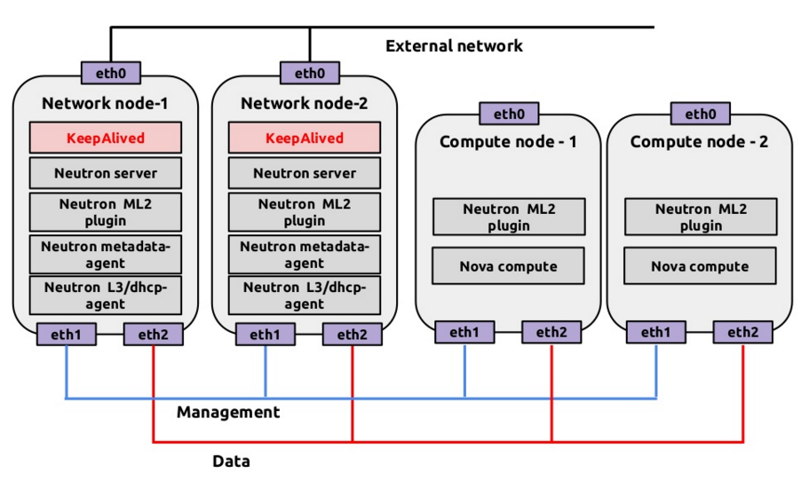

# Neutron Linxu Bridge VRRP 部署
建置 VRRP（Virtual Router Redundancy Protocol）時，我們需要針對 Controller、Network、Compute 節點進行 Neutron 設定檔配置，我們將針對以下的網路架構來達到 VRRP：


> 從以上架構圖可以看到，在 Network 節點需要兩台。假設兩台節點已經安裝與設定完成 Linux Bridge Agent、L3 Router、DHCP等套件。

# Controller 配置
在 Controller 節點編輯 ```/etc/neutron/neutron.conf```，並在```[DEFAULT]```部分加入以下：
```sh
[DEFAULT]
...
router_distributed = False
l3_ha = True
l3_ha_net_cidr = 169.254.192.0/18
max_l3_agents_per_router = 3
min_l3_agents_per_router = 2
dhcp_agents_per_network = 2
```

完成後，編輯 ML2 Plugins 設定檔```/etc/neutron/plugins/ml2/ml2_conf.ini ```，並在```[ml2]```部分加入以下內容：
```sh
[ml2]
type_drivers = flat,vlan,gre,vxlan
tenant_network_types = vxlan
mechanism_drivers = linuxbridge,l2population
extension_drivers = port_security
```

在```[ml2_type_flat]```部分加入以下內容：
```sh
[ml2_type_flat]
flat_networks = external
```

在```[ml2_type_vxlan]```部分加入以下內容：
```sh
[ml2_type_vxlan]
vni_ranges = 1:1000
```

在```[securitygroup]```部分加入以下內容：
```sh
[securitygroup]
enable_ipset = True
```

重新啟動 neutron-server 服務：
```sh
$ sudo service neutron-server restart
```

# Network 節點配置
在 Network 節點編輯 ML2 Plugins 配置檔 ```/etc/neutron/plugins/ml2/linuxbridge_agent.ini```，並在```[linux_bridge]```部分加入以下：
```sh
[linux_bridge]
physical_interface_mappings = external:eth1
```

在```[vxlan]```部分加入以下內容：
```sh
[vxlan]
local_ip = 10.0.1.21
enable_vxlan = true
l2_population = True
```
> ```local_ip``` 要隨不同節點改變。

在```[agent]```部分加入以下內容：
```sh
[agent]
tunnel_types = vxlan
prevent_arp_spoofing = True
```

在```[securitygroup]```部分加入以下內容：
```sh
[securitygroup]
enable_ipset = True
enable_security_group = True
firewall_driver = neutron.agent.linux.iptables_firewall.IptablesFirewallDriver
```

完成後，編輯 L3 Plugins 配置檔``` /etc/neutron/l3_agent.ini```，並```[DEFAULT]```部分加入以下內容：
```sh
[DEFAULT]
verbose = True
interface_driver = neutron.agent.linux.interface.BridgeInterfaceDriver
use_namespaces = True
external_network_bridge =
agent_mode = legacy
```

重新啟動 Neutron 所有服務：
```sh
sudo service neutron-linuxbridge-agent restart
sudo service neutron-dhcp-agent restart
sudo service neutron-metadata-agent restart
sudo service neutron-l3-agent restart
```

# 驗證服務
首先到 Controller 透過 neutron-client 來驗證服務都正確啟動：
```sh
$ neutron agent-list
+--------------------------------------+--------------------+----------+-------+----------------+---------------------------+
| id                                   | agent_type         | host     | alive | admin_state_up | binary                    |
+--------------------------------------+--------------------+----------+-------+----------------+---------------------------+
| 107a542a-c0e3-4dcd-a5f0-d9c0f8abaa84 | L3 agent           | network1 | :-)   | True           | neutron-l3-agent          |
| 51d1fc57-9212-485b-b85f-b2ae65f09204 | Metadata agent     | network2 | :-)   | True           | neutron-metadata-agent    |
| 78ec3aa3-867a-4443-964c-24ad7dadee77 | Metadata agent     | network1 | :-)   | True           | neutron-metadata-agent    |
| 88acdcee-ab9d-49f7-a796-2faa17d18c01 | DHCP agent         | network1 | :-)   | True           | neutron-dhcp-agent        |
| 961f8c55-6ef6-4ea2-917b-148e82bc1720 | Linux bridge agent | compute  | :-)   | True           | neutron-linuxbridge-agent |
| 99428553-2973-4ffe-b761-9d4aa1a17315 | DHCP agent         | network2 | :-)   | True           | neutron-dhcp-agent        |
| ba4085be-a6d6-43be-9548-4ec6fe4bed79 | L3 agent           | network2 | :-)   | True           | neutron-l3-agent          |
| bbc5f38d-c734-4b67-ad0a-62ee5f5ab290 | Linux bridge agent | network1 | :-)   | True           | neutron-linuxbridge-agent |
| c9017cee-e1b1-4541-ba89-001d726945a7 | Linux bridge agent | network2 | :-)   | True           | neutron-linuxbridge-agent |
+--------------------------------------+--------------------+----------+-------+----------------+---------------------------+
```

之後參考 [外部網路與租戶網路](ubuntu_create_netwrok.md) 來建立所有 L2、L3 虛擬網路。

完成後，該 Router 就會被分散到兩個網路節點，透過以下指令查看：
```sh
$ neutron net-list
+--------------------------------------+----------------------------------------------------+-------------------------------------------------------+
| id                                   | name                                               | subnets                                               |
+--------------------------------------+----------------------------------------------------+-------------------------------------------------------+
| de402f59-7f35-4d4c-91f9-c71697788f66 | ext-net                                            | 4dc913e3-3ea0-40f5-a23d-cf805012d180 10.21.20.0/24    |
| 625b1b7f-97a8-471b-809c-ecd903818ab2 | HA network tenant b42261813bfd48ac9f8f9a8d4d9345c0 | 01305303-c5cb-4e3d-adf3-48a380900073 169.254.192.0/18 |
| df325961-e7bb-4b89-bacf-493a75d0cb27 | admin-net                                          | 95fe4acc-a790-47bc-9edc-f8f12cfcee0a 172.17.1.0/24    |
+--------------------------------------+----------------------------------------------------+-------------------------------------------------------+
```

可以進一步查看 router 使用的節點狀態：
```sh
$ neutron l3-agent-list-hosting-router admin-router
+--------------------------------------+----------+----------------+-------+----------+
| id                                   | host     | admin_state_up | alive | ha_state |
+--------------------------------------+----------+----------------+-------+----------+
| 107a542a-c0e3-4dcd-a5f0-d9c0f8abaa84 | network1 | True           | :-)   | standby  |
| ba4085be-a6d6-43be-9548-4ec6fe4bed79 | network2 | True           | :-)   | active   |
+--------------------------------------+----------+----------------+-------+----------+
```

若沒問題，可以到任一個 network 節點看封包狀態：
```sh
$ sudo tcpdump -lnpi eth0
IP 169.254.192.2 > 224.0.0.18: VRRPv2, Advertisement, vrid 1, prio 50, authtype none, intvl 2s, length 20
IP 169.254.192.2 > 224.0.0.18: VRRPv2, Advertisement, vrid 1, prio 50, authtype none, intvl 2s, length 20
```
> 這邊```eth0```為 ```tunnel_eth```
