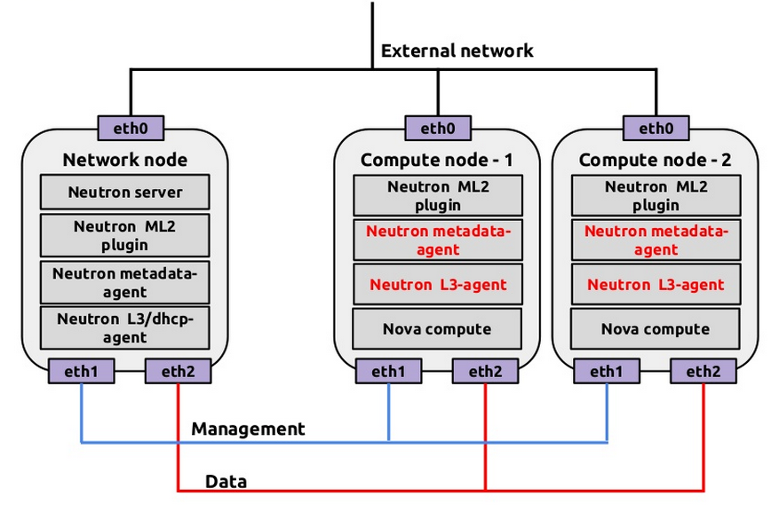

# Neutron DVR 部署
建置 DVR（Distributed Virtual Router）時，我們需要針對 Controller、Network、Compute 節點進行 Neutron 設定檔配置，我們將針對以下的網路架構來達到 DVR：


> 從以上架構圖可以看到，在 Network、Compute 節點需要安裝三張網卡，分別提供 Management Network、Tunnel Network、External Network。

# Neutron Controller 配置
在 Controller 節點編輯 ``` /etc/neutron/neutron.conf```，並在```[DEFAULT]```加入以下：
```sh
[DEFAULT]
...
router_distributed = True
```

完成後，編輯 ML2 Plugins 配置檔```/etc/neutron/plugins/ml2/ml2_conf.ini ```，並在```[ml2]```加入以下：
```sh
[ml2]
...
mechanism_drivers = openvswitch,l2population
```
重啟 Compute 服務：
```sh
sudo service nova-api restart
```
重啟 Networking 服務：
```sh
sudo service neutron-server restart
```

# Neutron Network 節點配置
在 Network 節點編輯 ML2 Plugins 配置檔 ``` /etc/neutron/plugins/ml2/ml2_conf.ini```，並在```[ml2]```加入以下：
```sh
[ml2]
mechanism_drivers = openvswitch,l2population
```
在```[agent]```加入以下：
```sh
[agent]
...
l2_population = True
enable_distributed_routing = True
arp_responder = True
```

完成後，編輯 L3 Plugins 配置檔```/etc/neutron/l3_agent.ini```，並加入以下：
```sh
[DEFAULT]
...
agent_mode = dvr_snat
```
在```Controller```上重新啟動```Compute API```服務：
```sh
sudo service nova-api restart
```
回到```Network```節點，重啟Open Vswitch服務：
```sh
sudo service openvswitch-switch restart
```
重新啟動 Networking 服務：
```sh
sudo service neutron-plugin-openvswitch-agent restart
sudo service neutron-l3-agent restart
sudo service neutron-dhcp-agent restart
sudo service neutron-metadata-agent restart
```

# Neutron Compute 節點配置
在安裝和設定 DVR 網路之前，必須設定某些核心網路參數，編輯```/etc/sysctl.conf```修改以下：
```sh
net.ipv4.ip_forward=1
net.ipv4.conf.default.rp_filter=0
net.ipv4.conf.all.rp_filter=0
net.bridge.bridge-nf-call-iptables=1
net.bridge.bridge-nf-call-ip6tables=1
```

修改後，透過```sysctl -p```來載入：
```sh
sudo sysctl -p
```

透過```apt-get```安裝 L3 agent、Metadata agent：
```sh
sudo apt-get install -y neutron-l3-agent  neutron-metadata-agent
```

在 Compute 節點編輯 ML2 Plugins 配置檔 ``` /etc/neutron/plugins/ml2/ml2_conf.ini ```，並在```[ml2]```加入以下：
```sh
[ml2]
mechanism_drivers = openvswitch,l2population
```

在```[ovs]```加入以下：
```sh
[ovs]
local_ip = TUNNEL_INTERFACE_IP_ADDRESS
bridge_mappings = external:br-ex
```

在```[agent]```加入以下：
```sh
[agent]
l2_population = True
tunnel_types = gre
enable_distributed_routing = True
arp_responder = True
```

編輯 L3 Plugins 配置檔```/etc/neutron/l3_agent.ini```，並加入以下：
```sh
[DEFAULT]
...
verbose = True
interface_driver = neutron.agent.linux.interface.OVSInterfaceDriver
external_network_bridge =
router_delete_namespaces = True
agent_mode = dvr
```

metadata agent 提供一些設定訊息，如Instance的的相關資訊。編輯```/etc/neutron/metadata_agent.ini```在```[DEFAULT]```部分設定服務存取與metadata主機，註解掉不必要設定：
```sh
[DEFAULT]
...
auth_uri = http://10.0.0.11:5000
auth_url = http://10.0.0.11:35357
auth_region = RegionOne
auth_plugin = password
project_domain_id = default
user_domain_id = default
project_name = service
username = neutron
password = NEUTRON_PASS
nova_metadata_ip = 10.0.0.11
metadata_proxy_shared_secret = METADATA_SECRET
```
> 這邊若```NEUTRON_PASS```有更改的話，請記得更改。

> 將其中的METADATA_SECRET 替換為一個合適的metadata 代理的secret。
> 若```METADATA_SECRET```有修改，請跟著修改。

### 設定Open vSwitch (OVS) 服務
OVS 服務為實例提供了底層的虛擬網絡框架。整合的橋接br-int 處理內部實例網絡在OVS 中的傳輸。外部橋接br-ex 處理外部實例網絡在OVS 中的傳輸。外部橋接需要一個在物理外部網絡接口上的端口來為實例提供外部網絡的訪問。本質上，這個端口連接了您環境中虛擬的和物理的外部網絡。**(未修改)**

重啟Open vSwitch服務：
```sh
sudo service openvswitch-switch restart
```
增加外部網路橋接：
```sh
sudo ovs-vsctl add-br br-ex
```
增加連接到實體外部網路介面的外部橋接埠口：
```sh
sudo ovs-vsctl add-port br-ex INTERFACE_NAME
```
> ```INTERFACE_NAME``` 為外部網路的介面名稱，這邊為eth2。

根據網路介面的驅動，可能需要禁用generic receive offload (GRO)來實現Instance和外部網路之間的合適的吞吐量。測試環境時，在外部網路介面上暫時關閉GRO：
```sh
ethtool -K INTERFACE_NAME gro off
```
> ```INTERFACE_NAME``` 為外部網路的介面名稱，這邊為eth2。

### 完成安裝
重新開啟服務：
```sh
sudo service nova-compute restart
sudo service neutron-openvswitch-agent restart
sudo service neutron-metadata-agent restart
sudo service neutron-l3-agent restart
```

# 參考文獻
* http://docs.openstack.org/networking-guide/scenario_dvr_ovs.html
* http://www.slideshare.net/janghoonsim/open-stack-networking-juno-l3-ha-dvr
* http://www.slideshare.net/emaganap/neutron-dvr
