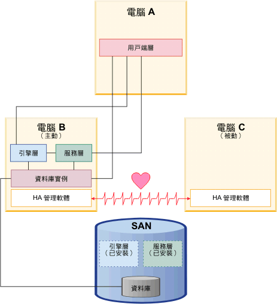

# OpenStack High Availability
要在自家的私有雲建置 OpenStack HA 的原因，不外乎就是為了要避免 SPOF 的問題發生，因此要確保以下幾個部分都有進行多重的備援：
* 網路元件，例如：Switch / Router
* 有自動化移轉機制的應用程式
* 儲存元件
* 其他基礎設施，例如：電力 / 空調 / 防火 .... 等等

## Stateless vs. Stateful services
OpenStack 中的眾多服務，可分為 **Stateless** 與 **Stateful** 兩種：

### Stateless
Stateless 服務的特色在於處理完使用者的 request 並回應之後就結束了，沒有後續的其他動作會繼續進行，提供查詢性質的服務幾乎都屬於此類，例如：nova-api / nova-conductor / glance-api / keystone-api / neutron-api / nova-scheduler ... 等等。

### Stateful
Stateful 服務通常所處理的一個動作都包含了多個 request，每個 request 怎麼進行通常會由前一個 request 的執行結果來決定，整體的運作狀況比起 Stateless 的服務相對複雜，像是 database / message queue 這一類的服務都屬於此種。

## Active/Passive 架構
在 Active/Passive 的架構下，會有多個 instance 提供相同的服務，但同時僅有一個 instance 會提供服務，**只有在當提供服務的 instance 掛掉時，才會由其他備援的 instance 繼續提供服務。**

### Stateless
為 Stateless 服務提供 Active/Passive HA 的情況，會使用一個 virtual IP 提供給外部 client 進行 request 之用。

因此當 virtual IP 後端的服務有掛掉時，則到 virtual IP 的 request 會自動被導至其他備援的 instance 繼續提供服務，因此對外部的 client 來說，其實是感覺不到有任何變更的。

### Stateful
由於 Stateful 的服務較為複雜，因此需要額外的監控軟體來監控服務是否正常，並在服務掛掉時啟動另外一個備援的 instance 來繼續提供服務。在監控軟體的部分，建議使用 [Pacemaker](http://clusterlabs.org/) 與 [Corosync](http://corosync.github.io/corosync/)，這是已經被許多人驗證過可行的選擇。相關的示意圖如下：

 

## Active/Active 架構
與上面不一樣的是，Active/Active 的架構下，不論是正在提供服務的 master instance 或是作為備援角色的 backup instance，都是同時在運作狀態的；當 master instance 掛掉時，backup instance 就可以馬上接手。

### Stateless
建置 Stateless 服務的 HA，通常會使用像是 [HAProxy](http://www.haproxy.org/) 的 Load Balance 服務，在多個 instance(master + backup) 之前提供一個 virtual IP 做為對外服務之用。

### Stateful
要建置 Statusful 服務的 HA，不僅僅是監控服務的狀態而已，還要額外包含 identical state，確保每一個 instance 都在相同狀態，舉例來說：當 master instance db 新增了一筆資料，則其他的 backup instance db 也同樣要新增一筆資料。

而要達成這功能，在每個 instance 之前就要放一個 Load Balance 的服務，將 request 送到每一個 instance 上來處理，用以維持 identical state 的狀態。

確保大家都在相同狀態，當服務掛掉時，backup instance 才可以無縫接上並繼續完成 master instance 的工作。

## 參考網站
* http://clhjoe.blogspot.tw/2014/05/openstack-high-availability-i-mysql.html
* http://godleon.github.io/blog/2015/05/20/Build-2-nodes-Linux-HA-Cluster-By-Corosync-Pacemaker/
