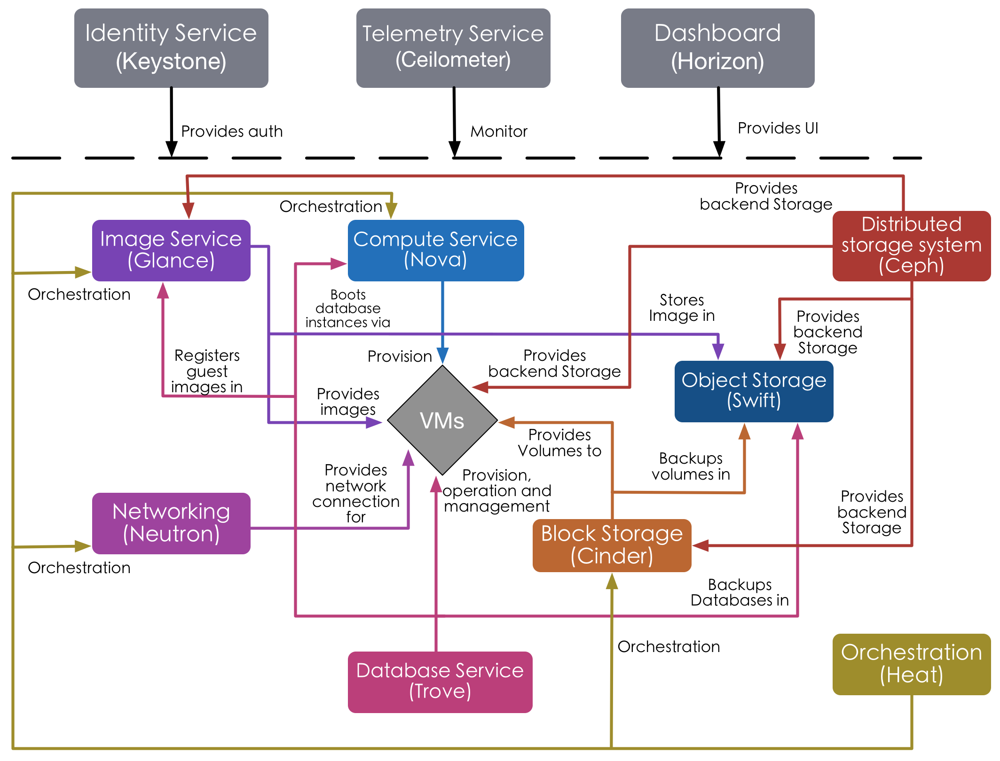
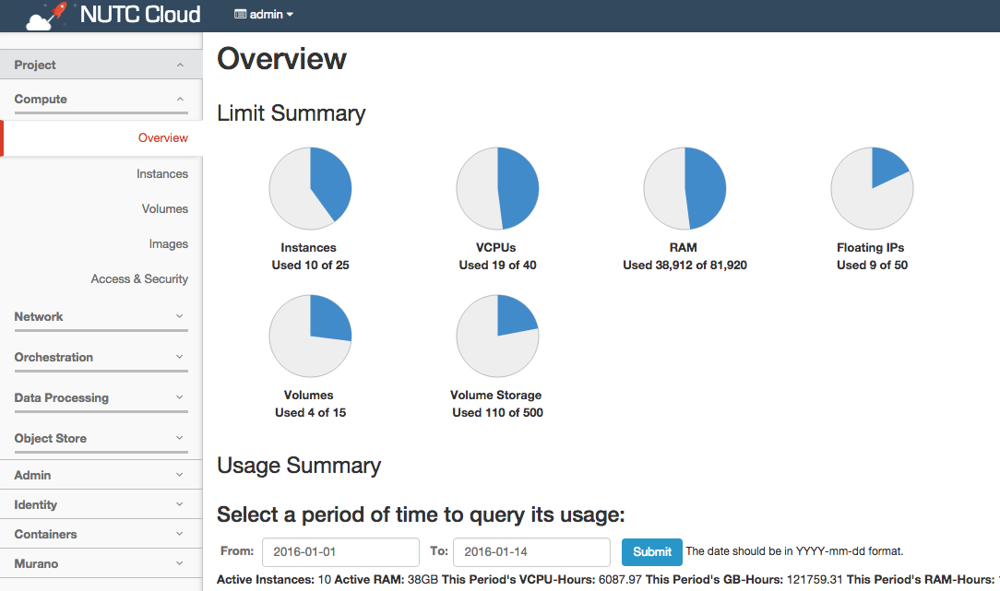

# Horizon 儀表板套件
OpenStack Horizon 提供了一個基於 Python Django Web 框架，使用者可以透過網頁瀏覽器來登入 Horizon，來進行 OpenStack 的控制儀表板的存取，好比開啟虛擬機、建立雲端硬碟、設定虛擬化網路資源等等。

從下面架構圖可以看到 Horizon 提供了 UI 功能給 OpenStack 元件進行存取與操作。



從官方文件可以得知 Horizon 採用了 Django Web 框架，若接觸過 Python 都知道 Django 是一個以 Python 語言開發的 Web 應用程式框架，Horizon 也以 Django 框架模式建立了好幾個應用程式，透過幾個 OpenStack 元件的 Django 應用程式的整合，來提供一個 OpenStack 控制儀表板的完整介面。

在 Django 一般會有幾種檔案存在，分別為```models.py```、```views.py```、```urls.py```與```*.html```檔案。這幾個檔案都分別負責對應的功能，如以下列表：
* **models.py**：利用 Python 類別來定義資料庫中的資料表、搜尋、插入等等操作，該資料會被映射到實際資料庫上。
* **views.py**：主要功能是如何讓網頁渲染，與畫面參數的傳遞，為畫面的商業邏輯。
* u**rls.py**：用來定義瀏覽器輸入的 URL 對應的畫面。
* ***.html**：簡單說就是主要的 html 頁面，這部分可以使用 Django 特有的內嵌板模語法。


然而由於 Django 的設計模式類似於 MVC(Model-View-Controller)，但 Django 自已處理了Controller 部分，而將重點放在Model、模板（Template）與 View，因此 Django 被稱為是一個 MTV 的架構。


最早釋出的 Horizon 只是一個簡單網頁應用程式，只注重幾個 OpenStack 專案套件的操作，但元件數隨時間增長，使 Horizon 對原有的簡單視圖與 API 提高了更多的要求。現在已發展到要具備所有 OpenStack 專案套件。現在的 Horizon 有以下幾個目標：
1. **支援 OpenStack 所有核心專案套件**
2. **可讓開發者自定義元件來給 Horizon 擴充**
3. **好管理的架構與程式碼**
4. **保持專案套件之間溝通互動一致性**
5. **API 向下相容**
6. **好的使用者體驗**

