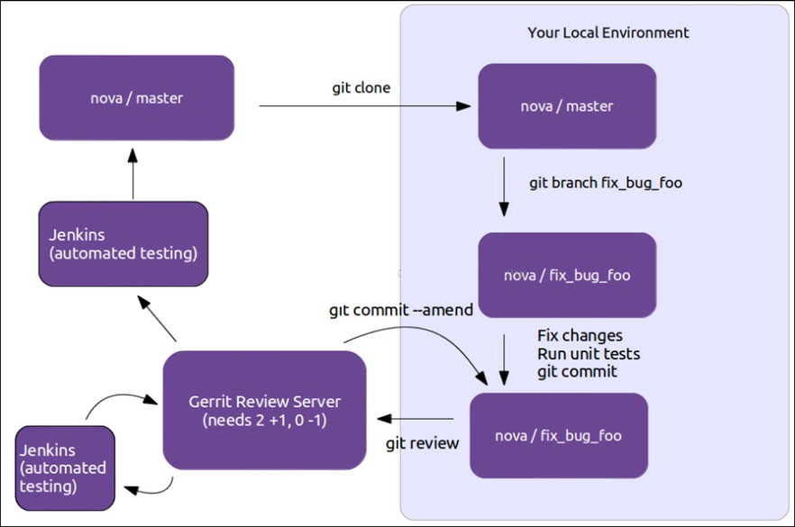

# OpenStack 貢獻指南
本部分將說明如何貢獻程式碼到 OpenStack 社群上。

### 申請 OpenStack 帳號流程
首先註冊 Launchpad.net 帳號：
1. 到 https://login.launchpad.net/ 註冊一個帳號，使用 inwinStack 信箱
2. 完成申請後，進入 https://launchpad.net/~inwinstack 點選`加入請求`
3. 確認自己出現在 inwinSTACK Menber List

之後註冊 OpenStack Foundation 的 Foundation Member，到 https://www.openstack.org/join/register 申請 `Foundation Member`。並完成以下步驟：
1. 填寫使用者資訊。
2. 在 Affiliations 部分，點選 `Add New Affiliations`的組織輸入`inwinSTACK`，選擇開始時間，勾選 `Is Current?`
3. 最後填寫住址與密碼資訊，住址翻譯網站 : http://goo.gl/qez9tt

然後使用 Launchpad.net  登入 OpenStack的Gerrit平台，到 https://review.openstack.org/ 點選 `sign in`，登入 Launchpad 帳號。當第一次登入成功後，會需要你設定唯一的 username（注意設定後就不能更改）。並完成以下步驟：
* 簽署 ICLA，
  * 到 https://review.openstack.org/#/settings/new-agreement
  * 選擇ICLA（OpenStack Individual Contributor License Agreement）
* 上傳 SSH 公有金鑰，
  * 到 https://review.openstack.org/#/settings/ssh-keys 上傳 Key。
  * 用`ssh-keygen -t rsa -b 4096 -C "your_email@example.com"` 指令產生金鑰，複製 `~/.ssh/id_rsa.pub`到 review.openstack.org 上。產生 key 參考 https://help.github.com/articles/generating-ssh-keys/

完成後，設定 Git 資訊：
```sh
git config --global user.name "Firstname Lastname"
git config --global user.email "your_email@youremail.com"

git config --global gitreview.username "yourgerritusername"
```
之後安裝 git-review，參考 http://www.mediawiki.org/wiki/Gerrit/git-review 進行安裝。

### 貢獻程式碼（已 openstack-manuals 為例）
一個基本的貢獻流程如下圖所示：


首先透過 git clone 來下載程式專案，並設定 review：
```sh
git clone https://github.com/openstack/openstack-manuals
cd openstack-manuals
git review -s
```
> 成功的話，會在目錄底下產生檔案`.gitreview`。若 auth 有問題請檢查 ssh key 是否正確。

並透過 git 來切換到最新版本：
```sh
git checkout master
git pull
```

新建一個 branch，在單獨的一行中撰寫 summary（小於50個字），然後第二段進行詳細的描述。如果是實現 bp 或修改 bug，需要註明：
* blueprint BP-NAME
* bug BUG-NUMBER

一個簡單範例：
```
Adds some summary less than  50  characters   

...Long multiline description of the change...   

Implements: blueprint authentication   
Fixes: bug # 123456
```
> 詳細的程式碼提交資訊，參考：https://wiki.openstack.org/wiki/GitCommitMessages。

修改完程式碼後，記得跑過UT的測試。然後提交程式碼，並申請 review：
```sh
git commit -a
git review
```

提交 review 之後，會出現在https://review.openstack.org，可以查看狀態和資訊，並自動執行 CI，然後程式碼會由 review 人員進行程式碼的 review。

如果 jenkins 回報了 failure，可以查看 Logs 除錯。如果確認不是自己的 patch 導致，可以在 comment 上留言 `recheck no bug`，重新再跑 Test。

如果 review 過程中，發現程式碼需要修改，再次提交時直接使用已存在的 Change-Id：
```sh
git commit -a --amend
git review
```
