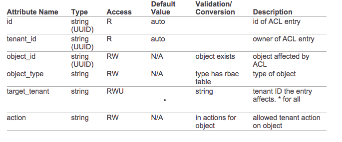

# OpenStack Multi-Tenant Isolation

### MANAGE HOST AGGREGATES
* **Host aggregates** - A host aggregate creates logical units in a OpenStack deployment by grouping together hosts. Aggregates are assigned Compute hosts and associated metadata; a host can be in more than one host aggregate. Only administrators can see or create host aggregates.

* **Availability zones** - An availability zone is the end-user view of a host aggregate. An end user cannot view which hosts make up the zone, nor see the zone's metadata; the user can only see the zone's name.

### Enable Host Aggregate Scheduling
By default, host-aggregate metadata is not used to filter instance usage; you must update the Compute scheduler's configuration to enable metadata usage:
1. Edit the ```/etc/nova/nova.conf``` file (you must have either root or nova user permissions).
2. Ensure that the ```scheduler_default_filters``` parameter contains:
    3. 'AggregateInstanceExtraSpecsFilter' for host aggregate metadata. For example: 
    ```
    scheduler_default_filters=AggregateInstanceExtraSpecsFilter,RetryFilter,RamFilter,ComputeFilter,ComputeCapabilitiesFilter,ImagePropertiesFilter,CoreFilter
    ```
    4. 'AvailabilityZoneFilter' for availability host specification when launching an instance. For example:
    ```
    scheduler_default_filters=AvailabilityZoneFilter,RetryFilter,RamFilter,ComputeFilter,ComputeCapabilitiesFilter,ImagePropertiesFilter,CoreFilter
    ```

#### Host Aggregate Metadata
| Key | Description |
| -- | -- |
| cpu_allocation_ratio | Sets allocation ratio of virtual CPU to physical CPU. Depends on the ```AggregateCoreFilter``` filter being set for the Compute scheduler. |
| disk_allocation_ratio | Sets allocation ratio of Virtual disk to physical disk. Depends on the ```AggregateDiskFilter``` filter being set for the Compute scheduler. |
| filter_tenant_id | If specified, the aggregate only hosts this tenant (project). Depends on the ```AggregateMultiTenancyIsolation``` filter being set for the Compute scheduler. |
| ram_allocation_ratio | Sets allocation ratio of virtual RAM to physical RAM. Depends on the ```AggregateRamFilter``` filter being set for the Compute scheduler. |

# Role-based Access Control for Networks
Role Base Access Control is a technique that limits access to resources based on a specific set of role(s) associated with each user's credentials.
```sh
NET="31d634b7-41a7-43c7-abd0-64bda42d733a"
TENANT_ID="5bd1d00abafc4ae29b6bc7f41932d66c"
neutron rbac-create ${NET} --type network --target-tenant ${TENANT_ID} --action access_as_shared
```

#### Update
```
neutron rbac-update <rbac-uuid> –-target-tenant <other-tenant-uuid>
```

#### List entries
```
neutron rbac-list
```

#### Show entry
```
neutron rbac-show <object-id>
```

####  Deleting
```
neutron rbac-delete <rbac-uuid>
```

####  List available actions
```
neutron rbac-list-actions <object-type>
```




# Reference URL
* [RedHat Multi-Tenant Isolation](https://access.redhat.com/documentation/en-US/Red_Hat_Enterprise_Linux_OpenStack_Platform/6/html/Administration_Guide/section-host-aggregates.html#table-aggregate-keys)
* [Scheduling Filters](https://access.redhat.com/documentation/en-US/Red_Hat_Enterprise_Linux_OpenStack_Platform/6/html/Administration_Guide/section-scheduler.html#section-scheduler-filters)
* [OpenStack Multi-Tenant Isolation (Nova and Cinder)](http://www.hitchnyc.com/openstack-multi-tenant-isolation/)
* [HPE Helion Metering Service (Ceilometer): Role Based Access Control (RBAC)](http://docs.hpcloud.com/commercial/GA1/ceilometer/1.1commerical.services-reporting-RBAC.html)
