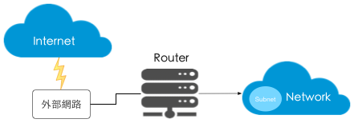

# Neutron 網路套件
Neutron 為 OpenStack 提供了 ```Network Service```，負責虛擬網路架構與外部實體網路架構（包含個廠商設備）之間的整合與存取，用來為 Tenant 可在同一個實體網路上行定義獨立```網路（Network）```、```子網路（Subnet）```、```埠口（Port）```等與建立```防火牆```，```負載平衡```，```VPN```等網路環境。

假設有一個由管理員建立的外部網路，來負責使 OpenStack整個網路與 Internet 連接，之後 Tenant 可以建立自己私有的內部網路來連接外部網路，要讓內部網路中的虛擬機能夠存取 Internet，就必須建立一個 Router 將內部網路連接到外部網路。



這些過程中，Neutron 提供一個 L3 的抽象 Router 與 L2 的抽象Netowrk router 來映射於真實網路環境的 Router，為使用者提供 Route、NAT等服務，Network 則對應於一個第二層區域網路（LAN）的實體，該網路則為 Tenant 的所有。

然而在 Neutron 的 subnet 實作上來看，並無法完全它是實體網路中的子網路概念。Subnet 屬於網路中的```第三層```概念，指定一段 IPv4 或者 v6 位址並描述相關配置資訊，它附加在一個第二層 Network 上來指定屬於可使用的 IP 位址範圍。一個 Network 可以同時擁有 IP v4 與 IP v6 的 Subnet。

網路設定的概念其實跟我們之前所學的並沒有差太多，包含 DHCP、VLAN、Routing … 等等。

比較值得一提的是 Networking Service 支援了 Security group 的概念，也提供了OSI模型七層部分的網路虛擬化，其功能如下：
* **網路的聯通性，第二層網路與第三層網路實現。**
*** Tenant 的隔離性。**
* **網路的擴展性。**
* **管理者可以針對每個 security group 進行防火牆規則的設定。**
* **REST API 實現**
* **每個 VM 可以屬於一個或多個 security group。**
* **更高級別的服務，諸如LBaaS、FWaaS、VPNaaS等。**

有了以上的機制，讓 Firewall-as-a-Service 以及 Load-Balancing-as-a-Service 等變很容易去實現。


# Linux 中的虛擬化網路
在討論 Neutron 細節的虛擬化功能前，我們需要先了解 Neutron 應用到的 Linux 上的網路虛擬化技術。

### VTH
### Bridge
### Open vSwitch


# Neutron 中的虛擬化網路


