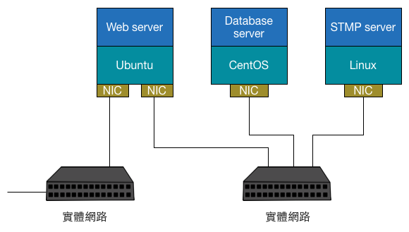
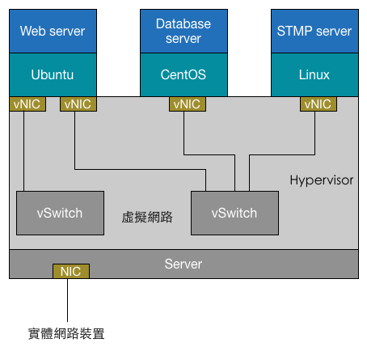

# Linux 中的虛擬化網路
在討論 Neutron 細節的虛擬化功能前，我們需要先了解 Neutron 應用到的 Linux 上的網路虛擬化技術。Neutron 最核心的工作是對第二層實體網路 Network 的抽象與管理。在一個傳統的實體網路下，可能有多組實體 Server，上面分別執行各種應用，諸如：Web、Database等服務，為了能夠彼此溝通
，每台主機都會擁有一張實體網卡（NIC），每張網卡會連接到一台實體交換器（Switch）上，如下圖所示：


然而虛擬化技術被導入後，傳統的多作業系統與應用可以透過虛擬機方式分享同一實體 Server，虛擬機的管理、啟動、建立等操作 Hypervisor（或者 VMM，Virtual Machine Manager）來完成，然而形成了以下的網路結構：



虛擬機的網路功能是利用虛擬網卡（vNIC）提供，Hypervisor 可以為每個虛擬機建立一張或多張虛擬網卡。為了實現與傳統實體網路相等的網路結構，Switch 也被虛擬化為 虛擬交換器（vSwitch），這樣 vNIC 會連接於 vSwitch 上，最後 vSwitch 會透過實體主機 NIC 存取外部的實體網路。

由上述可見，對一個虛擬的第二層網路結構來說，主要完成兩種網路設備的虛擬化```Network interface controller（vNIC）```、```Switch（vSwitch）```，在 Linux 等下網路裝置的虛擬化有以下幾種，然而 Neutron 也是基於這些技術來完成 Tenant 私有網路的建置。

### TAP/TUN
TAP/TUN 是 Linux Kernel 實現的虛擬化網路設備，TAP 運作於```第二層網路```，TUN 運作於```第三層網路```，Linux Kernel 透過 TAP/TUN 向使用該設備的 User-space 程式發送數據，反之 User-space 程式也可以像操作硬體網路設備一樣，透過 TAP/TUN 設備發送數據。
### VTH
### Bridge
### Open vSwitch
