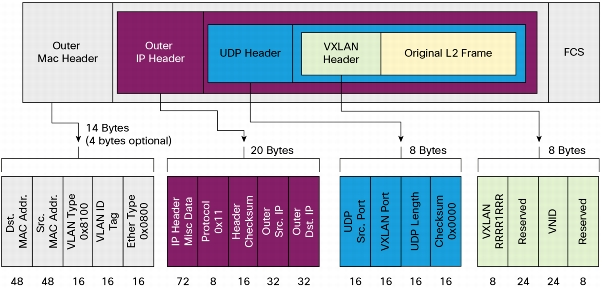

# VXLAN
VXLAN（Virtual Extensible LAN，虛擬擴展區域網路）是一種網路虛擬化技術，它試圖改善大量雲端運算環境部署相關的可擴展性問題。VXLAN 是一種 Overlay 的網路技術，使用 MAC in UDP 的方法進行封裝，簡單說就是 VLAN 的擴充，使其可以透過多個第三層網路連接的網路表現如一台台實體交換器連接而成的網路一樣。

該技術實現機制是將第二層網路封包加上 VXLAN Header，並封裝到一個 UDP 封包中進行傳輸，如下圖。

VXLAN Header 會包含一個 24 位元的 ID（VNI），類似於 VLAN ID 或 GRE Tunnel ID，該數量的 VNI 解決了 VLAN ID 的 4094 數量限制。VXLAN 中封裝與解封是使用 VTEP（VXLAN Tunnel End Point）來實現，同時架設於 UDP 協定上可以穿越三層網路，比 VLAN 有更好的擴展。

VXLAN 網路設備主要有三種角色，分別是：
* VTEP（VXLAN Tunnel End Point）：
* VXLAN GW（VXLAN Gateway/第二層閘道）：
* VXLAN IP GW（VXLAN IP Gateway/第三層閘道）：

VXLAN 解決了 VLAN ID 數量限制與跨區域互聯問題，同時解決 GRE 點對點通道個數過多問題，且實現第二層網路，可用於 Instance 在區域之間的無縫遷移。以下為幾個特點：
* VNI 為 24 位元，最大為 16777216，每一個 VNI 為一個網段，同網段 Instance 才能互相溝通。
* 使用 UDP Port，預設為 4789，可自行修改。
* 兩個 VTEP 之間的 VXLAN Tunnel 是無狀態的。
* VTEP 可在虛擬交換器（Open vSwitch）、實體交換器或者主機透過軟體/硬體實現。
* 使用多點傳送來傳送未知目的地、廣播或者多點傳送的 Frame。
