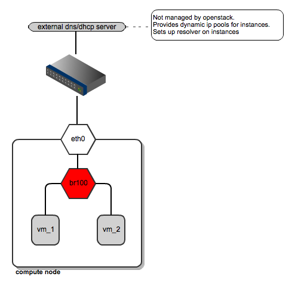
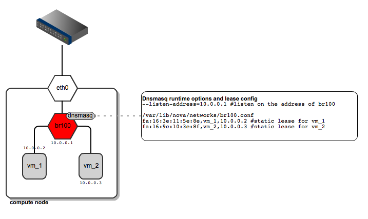
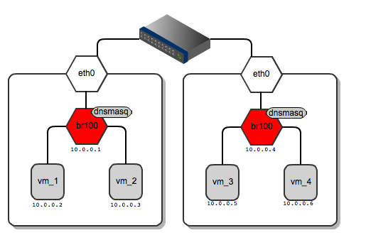

# Nova Network
在 OpenStack 網路套件還沒被獨立出來時，OpenStack 的網路是採用```nova-network```（或稱 Legacy network）。在 nova-network 中的網路管理支援了三種模式，三種模式採用了 Linux Bridge 的方式來連接外部網路，本節將描述 nova-network 的三種模式差異。

nova-network 提供以下一些功能：
* NAT (iptables, ip)
* VLAN (ifconfig, brctl)
* DHCP Server (dnsmasq)
* DNS Server (dnsmasq)
* Firewall (iptables)

## Flat Network Manager
在這個網路模式下的所有 Instance 都是橋接（bridge）到同一個虛擬網路，且相關的網路設定都是管理者處理，如 IP、Subnet、Bridge等，都手動設定網路橋接。需在 Compute 節點上安裝 Linux bridge 來提供給 Instance 掛載橋接，如下圖：

<center> 

Flat 網路模式由於許多不滿足企業需求，一般被用於測試環境使用。Flat 網路的缺點：
* 存在單一網路瓶頸，且缺乏可延展性。
* 沒有多租戶（Multi-tenancy）的網路隔離。
* 網路依賴外部，如 DNS、DHCP等
* 沒有 L3 的虛擬化網路

## Flat DHCP Network Manager
在這種模式下，OpenStack 會啟動一個 DHCP 伺服器（dnsmasq）與 bridge 綁定來提供 DHCP 及DNS 服務，並從指定的子網路分配 IP 位址給 Instance，可根據手動設定網路橋接（bridge）、子網路（subnet）來改變，因此對於 Instance 的 IP 管理都是由管理員指定的子網路分配。

如 Flat 網路模式，所有 Instance 都掛載於 Compute 節點上的單一網路橋接。此外，DHCP 伺服器設定依賴於 Single/Multi-host 模式。在這種模式下，Compute/Controller 節點會多設定一些參數，比如設定```flat_interface```。

<center> 

> 在單一主機的 Flat DHCP 模式下，可以從安裝 nova-network 的節點（一般為 Controller) ping 到 Instance，但無法從 Compute 節點 ping 到 Instance。

> ```P.S.``` dnsmasq 發給 Instance 的是固定 IP，這確保了 Instance 反覆啟動都可以取得相同 IP 以便資源的管理與利用。

該模式在 L2 基本上是可以 Ping 到其他 Compute 節點的 Instance，如下圖。但也可以透過設定檔來取消。


該模式會分為 Single/Multi-host 的部署方式，上述提到的就是一個 Multi-host ，然而 Single-host 部署架構圖如下，這樣方式網路南北向（連到外部的網路）會依賴於 Controller 橋接網卡，且有單點故障問題：


Flat DHCP 網路模式可被用於小型的企業，主要提供小型的內部網路環境部署。在 Flat DHCP 網路模有以下缺點：
* L2 沒有多租戶（Multi-tenancy）的網路隔離。
* 因為採用 Linux Bridge，所以只能連接一張網卡。
* 沒有 L3 的虛擬化網路
* 提供的高層級網路功能有限，只有基本的安全群組，

## VLAN Network Manager
VLAN（Virtual Local Area Network）是一種建構於區域網路交換技術（LAN Switch）的網路管理的技術，透過將區域網路裝置從邏輯劃分多個網段，來實現虛擬網路群組。

在該模式主要為了解決 Flat/Flat DHCP 網路的```L2 隔離```與```擴展性```問題。透過設定```VLAN ID```與```Tenant ID```來做網路的隔離。

<center> 

從上圖可以看到 Tenant 在 Compute 節點上會有自己的 Linux bridge，來連接網卡的 VLAN Tag，該 Tenant 所有 Instance 都會連到這個專屬的橋接上，並有自己的 dnsmasq 來提供 DHCP 與 DNS 管理。

VLAN 網路模式被用於中小型企業，透過 VLAN 提供網路的隔離，從而提升企業網路安全性。但 VLAN 網路模式依然存在許多缺點，如下：
* 實體交換器需要支援 VLAN（802.1Q）。
* VLAN 的 ID 只能有 4094 個的 Tagging。
* 沒有 L3 的虛擬化網路