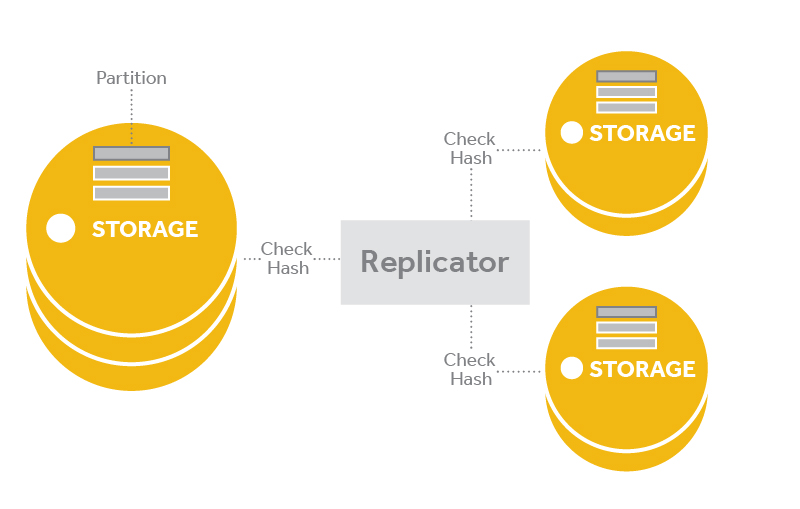
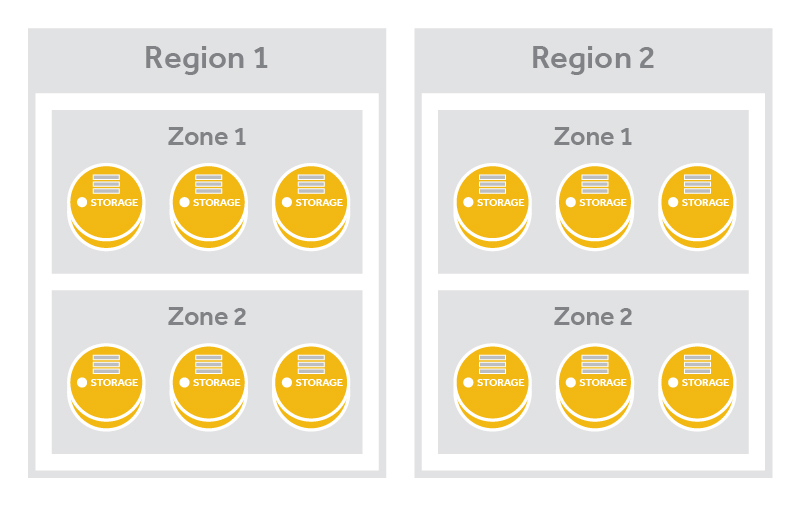

# Swift 物件儲存套件
OpenStack Swift存是一個多租戶的物件儲存系統，它支援了大規模擴展，的分散式物件儲存叢集，來達到PB等級的容量，並以低成本來管理大型的非結構化資料，通過RESTful HTTP 進行應用程式介面的溝通。Swift擁有以下幾個特點（官方還有更多，約二十幾項左右）：
* 屬於Open source，且可以水平擴展叢集、提供避免SPOF問題、更換硬體無需移動metata等功能。
* 許多大型的物件儲存雲端採用Swift
* Swift 可以提供單一以及其他環境的整合
* 標準 X86 架構硬體，搭配標準Linux OS，就能運作Swift
* Swift跟Amazon S3相同，提供最終一致性(eventual consistency)
* 任何存在的 Swift 物件、檔案都有一個URL
* 提供標準的 RESTful HTTP API，非常適合作為經由 web-based存取資料的Client、Device、Application
* 儲存於 Swift 的物件能有可擴展的metadata，用來有效的進行檢索與搜尋
* 採用Zone與Region來為所有存在Swift的物件有多個複本
* 可儲存超大量非結構性資料
* 極高的資料永久性
* 完全對稱的系統架構


架構圖，執行了以下操作：
1. Proxy Server 是直接接受來自 client 請求的部分。
2. Proxy Server 收到 client 請求後，會透過 Ring 快速地進行 object 的存取 or 將資料同步到不同的 Object Server(storage node) 上。
3. 不同的 Object Server 可能會根據不同的規劃(地理區域、服務對象、功能性….等)，區分成不同的 Zone(or Region) 作為管理之用。

由於所有儲存在 Swift 的物件、檔案都有一個 URL，並可透過 HTTP RESTful API 存取。下圖為Swift的儲存架構：

由圖中會看到Client會透過Proxy Server利用一個名為```Ring```的元件執行與分配給底下三個角色：
* **Account**：Account storage是整個Swift中獨一的名稱，但在概念上並不屬於使用者的帳號或者驗證資訊，而是一個儲存區域的概念。在Account storage中，包含Account相關的metadata、儲存在Account內的Container資訊。
* **Container**：Container storage屬於使用者自定義的儲存區域，與Container本身相關的metatadata，主要的物件存放地點。
* **Object**：Object storage存放著自身的資料，以及跟檔案相關的metadata。

當有了以上三種概念，我們要進一步Object的URL結構：
```sh
http://controller:8080/v1/AUTH_5b091f4b50194fd292c1b49da4cc7297/kairen/test
```
從上面可以看到```AUTH_5b091f4b50194fd292c1b49da4cc7297```部分為Account，而```kairen```則是一個Container，最後則是```test```就是一個物件。
其中 URL 結構包含兩個主要部分:
* **API 位置**：```http://controller:8080/v1/```部分
* **Object 位置**：```AUTH_5b091f4b50194fd292c1b49da4cc7297/kairen/test```部分


### 叢集服務架構
在叢集中，運行著Swift Proxy Server或者是Service的，我們稱之為```Proxy Node```，然而運行著Account / Container / Object Server的，我們稱之為```Storage Node```（另外包含了處理資料一致性的 consistent service）。下圖展示了一個Proxy與Storage節點叢集：


Swift包含了以下元件：
* **Proxy servers (swift-proxy-server)**：接收來自OpenStack 物件儲存API與單純的HTTP Request與Response來上傳檔案、更改metadata、建立Container。可服務再web browser下列出檔案與Container列表。為了改進效能，Proxy service可以選擇性使用cache，通常會使用```memcache```。
> 建議至少使用兩個 proxy node，以避免 ```single point failure``` 的狀況發生。

* **Account servers (swift-account-server)**：管理由物件儲存定義的帳號，  以及所包含相關的 Container 資訊。這些資訊都存放在```Account server process```伺服器中的SQLite裡。
* **Container servers (swift-container-server)**：管理Container或者是檔案夾映射到物件儲存內部的相關資訊，
管理容器或文件夾的映射，對象存儲內部。這些資訊都存放在``` Container server process ```伺服器中的SQLite裡。
* **Object servers (swift-object-server)**：管理實際的物件儲存，諸如：檔案。檔案是以二進位的方式儲存於磁碟中，還包含```timestamp```資訊，timestamp可以讓 Swift 同時儲存多種不同版本的檔案。而Object的metadata以副檔名 ```xattrs``` 的作法與object儲存一起，再由swift負責將這些資料複製到數個不同節點上。
* **Various periodic processes**：為了負荷大型資料儲存，複製服務需要在叢集內保持最終一致性(eventual consistency)與可用性，其他週期性的process包含auditors, updaters, and reapers。
* **WSGI middleware**：使用OpenStack identity service處理驗證。

### Swift Consistency Services
為了確保每個 storage node 之間的資料一致性，Swift 提供了兩個重要的 Service，分別為以下：
* **Auditor**：本服務運行於每個 Storage 節點上，透過週期性掃描disk是否有發生錯誤，若有錯誤 Auditor service 就會將該問題 Object 移至隔離區域。
> 每一個 process(Account / Container / Object) 都有專屬的 Auditor 進行資料檢查之用。


* **Replicator**：主要確保本地資料與叢集中的其他Storage節點的資料一致性。需要注意的是它只會將新資料送到其他節點，而不會從其他節點抓取新資料來更新本地資料。而Replicator是透過 ```checksum```方式達到資料的一致性。
> 每一個 process(Account / Container / Object) 都有專屬的 Replicator 進行資料一致性。

 

### Swift Cluster
Swift 是由好幾台Proxy node與Storage node組合而成，為了好區分而採用了Region以及Zone的邏輯概念來分別。以圖顯示了 ```Region``` 與 ```Zone``` 的方式：

* **Zone**：由多個Storage node組成，一般情況是用來作為資料中心內部，如同機櫃的分類作用，或是將特別用的的 Node 歸類。

* **Region**：由多個 Zone 組成，一般常用來區分不同區域的資料中心。
> Region與Zone 是使用者可自行定義的，可參考部署Swift。

 

### Data Placement
Swift為了有效地跨 Storage node 存放資料，並可達到快速存取目的，在資料存放的模組是經過特別設計而成，下圖顯示了資料存取層次：

可以看到圖中有三個要素：
* **Storage Node**
* **Disk**
* **Partition**

每一個 Storage node 可能有多個Disk，而 Partition 在這並非傳統的磁碟分割概念，而是把它當作是 Disk 的一個目錄的概念，因此一個 Disk 會有很多的 Partition。

Partition 則是 Swift process 處理的最小單位，資料實際存放的地方，而 consistency process 則是以 partition 為單位來檢查資料的一致性（consistency）
，資料在不同硬體裝置上移動也是以 partition 為單位。

透過 partition 作為單位來處理的方式，Swift 可以減少 Process以及網路的負擔。
### Ring
Ring 在 Swift 中扮演著相當重要的角色，它是一個映射檔案以及由一致性的Hash演算法產生，用於記錄儲存物件與物理位置之間的映射關係。在涉及查詢 account、container、object 訊息時，就需要查詢叢集的 Ring 資訊。共分為了三種Ring，分別為：
* **Account Ring**
* **Container Ring**
* **Object Ring**

我們透過 Ring 來得知 object 實際對應到的 Account 、 Container以及實際存放的partition，如下圖：


Ring 存在於 Swift Storage 叢集的每個節點上，透過 Ring 可以確保每個 object 在叢集中的每個Storage節點有多個複本存在，也可以確保後續可以進行快速存取。

並透過維持一致性的 Ring，叢集不僅避免了```SPOF```問題發生，也提升存取效能，更增加了水平擴展能力。

# 參考
* https://swiftstack.com/openstack-swift/
* http://fanli7.net/a/bianchengyuyan/PHP/20120622/174582.html
* http://fanli7.net/a/bianchengyuyan/Python/20120628/177804.html
